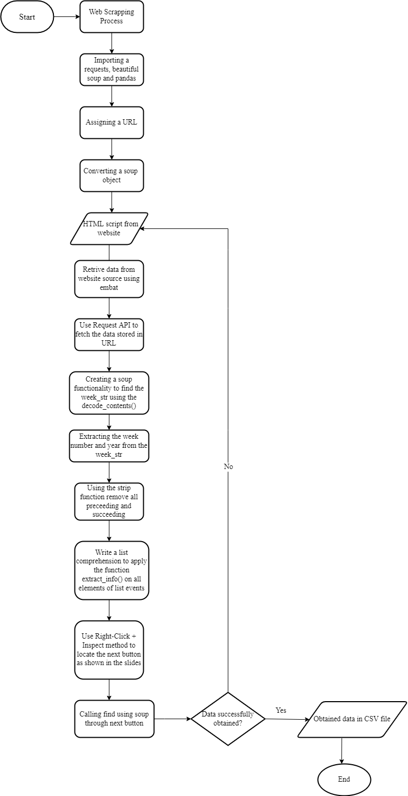

# Automatic Disaster Detection and Damage Assessment
In this project using the 
**Natural Language Processing**, we have decided
to build a **Automatic Disaster Detection and Damage Assessment** for the purpose to
use NLP based methods to extract attributes like type of the disaster,place of the disaster and name of the disaster.

Under guidance of [Mr. Samvram Sahu](https://www.facebook.com/samvram), Scientist/Engineer-SC [National Remote Sensing Center](https://www.nrsc.gov.in/)

The team members include:
* Midhuna R
* Pavithra V

## Proposed Methodology

Collection of disaster related data requires ground-based
evaluation of the affected site and region. We can use the
openly available data on the internet to extract necessary
information on when, where and how the disaster has
struck. The extent of damage can also be roughly
estimated and the different attributes can also be taken
up from the news sites. We propose to use NLP based
methods to extract attributes like type of the disaster,
place of the disaster and name of the disaster.

###### Using Technical Requirements:

 python based development,
 web scrapping - libraries
Selenium
beautiful soup
Pandas
 RASA NLU [NLP].

## Flowchart

